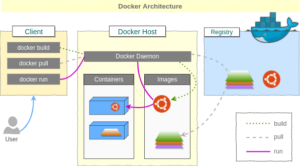

# Docker Tutorial
> Chúng ta sẽ đi tìm hiểu docker kỹ nhất có thể
# Mục lục
## [I. Giới thiệu về docker](#I-giới-thiệu-về-docker)
## [II. Cài đặt](#ii-cài-đặt)
## III. Các câu lệnh

## I. Giới thiệu về docker
### 1. Những vấn đề gặp phải khi triển khai hệ thống
Khi triển khai hệ thống chúng ta sẽ phải cài đặt môi trường trên từng máy. Mỗi máy nhìn chung sẽ có những thư viện ở phiên bản khác nhau. Nếu chúng ta có một hệ thống đã được code hoàn chỉnh trên 1 máy và muốn triển khai trên các máy khác thì cần phải đi cấu hình thủ công sao cho các thư viện phù hợp với hệ thống. Việc cấu hình này là rất vất vả và có thể lỗi do không tương thích môi trường. Từ đó, chúng ta cần một công cụ để cho việc cấu hình này trở nên đơn giản hơn. 
### 2. Docker là gì?

Docker là một dự án mã nguồn mở giúp tự động triển khai các ứng dụng Linux và Windows vào trong các container ảo hóa. Docker cung cấp một lớp trừu tượng và tự động ảo hóa dựa trên Linux. [wiki](https://vi.wikipedia.org/wiki/Docker_(ph%E1%BA%A7n_m%E1%BB%81m))

Hiểu một cách đơn giản, Docker sẽ tạo ra một môi trường cô lập (isolated environment), trong môi trường đó chúng ta có thể cài các thư viện, các dependencies, ... mà không ảnh hưởng tới đến môi trường bên ngoài.
### 3. Ưu điểm của docker
- Phân phối ứng dụng nhanh và nhất quán phù hợp với tích hợp liên tục (CI) và triển khai liên tục.
- Có thể chạy ở nhiều nơi: Máy vật lý, máy ảo, ..., ở các hệ điều hành khác nhau.
- Nhẹ và nhanh, thời gian start, stop, build và remove trên docker nhanh hơn nhiều so với máy ảo.
- Giữ cho môi trường chạy dự án và môi trường máy của chúng ta được độc lập. Khi một dự án hoàn thành mà chúng ta có nhu cầu xóa thì sẽ không ảnh hưởng tới các dự án còn lại.
### c. Các khái niệm
Kiến trúc của Docker được thể hiện như sau:

Nhìn vào kiến trúc, có một vài khái niệm chúng ta cần nắm được:
- `Client`: là giao diện dòng lệnh chính là nơi chúng ta thao tác với docker thông qua command (câu lệnh) ở trong `terminal`/`shell`. `Client` sẽ cho phép người dùng gửi các lệnh và nhận phản hồi từ `docker daemon` để thực hiên các thao tác quản lý.
- `Docker daemon`: là một tiến trình chạy trên hệ điều hành và nó quản lý docker. Nó lắng nghe các yêu cầu Docker API từ `client` và quản lý các Docker object. `Docker daemon` cũng có thể giao tiếp với các `Docker daemon` khác để quản lý các dịch vụ.
- `Registry`: là một hệ thống lưu trữ và phân phối các `Docker images`. Docker registry cho phép lưu trữ và phân phối các images. [Docker Hub](https://hub.docker.com/) là registry mặc định được Docker sử dụng, nhưng chúng ta cũng có thể thiết lập và sử dụng registry riêng của mình.
- `Docker images`:
- `Docker container`:
- `Docker network`:
## II. Cài đặt
### 1. WSL
Docker được chạy trên hệ điều hành `Linux`, vì vậy khuyến khích nên thực hành trên `linux`. Nếu bạn đang sử dụng hệ điều hành window mà không muốn dùng các phần mềm ảo hóa như VMWare hoặc Virtual box thì có một sự lựa chọn tuyệt vời đó là sử dụng subsystem `WSL`. Nó là một hệ thống Linux được xây dựng bên trong window mà không cần máy ảo riêng biệt, vì vậy hiệu năng cũng như tốc độ của nó sẽ rất ổn định. Hơn nữa, khi dùng `WSL` chúng ta cũng sẽ tránh được các lỗi liên quan đến bộ nhớ, các phần mềm ảo hóa chúng ta thường gặp một vài trường hợp mà ổ đĩa vẫn còn nhưng máy ảo lại báo là hết dung lượng không cho ghi. <br>
Cài đặt `WSL` như sau
- Ở `terminal`
```sh
wsl --install
```
- Khởi động `WSL` thông qua câu lệnh
```
wsl
```
hoặc
```
ubuntu
```
Hoặc sử dụng tổ hợp `window + R` và gõ `ubuntu`
> Khi sử dụng `wsl` sẽ dẫn đến đường dẫn `/mnt/c/Users/QuangHuy$` và `ubuntu` sẽ dẫn tới `~` (`home`)
### 2. Câu lệnh cài đặt
- Các bản phân phối có thể cung cấp các bản không chính thức của các gói Docker trong APT. Chúng ta phải **gỡ cài đặt** các gói này trước khi có thể cài đặt phiên bản chính thức của Docker Engine.
```shell
for pkg in docker.io docker-doc docker-compose docker-compose-v2 podman-docker containerd runc; do sudo apt remove $pkg; done
```
- Cài đặt `Docker repository`
```sh
# Add Docker's official GPG key:
sudo apt update
sudo apt install ca-certificates curl
sudo install -m 0755 -d /etc/apt/keyrings
sudo curl -fsSL https://download.docker.com/linux/ubuntu/gpg -o /etc/apt/keyrings/docker.asc
sudo chmod a+r /etc/apt/keyrings/docker.asc

# Add the repository to Apt sources:
echo \
  "deb [arch=$(dpkg --print-architecture) signed-by=/etc/apt/keyrings/docker.asc] https://download.docker.com/linux/ubuntu \
  $(. /etc/os-release && echo "$VERSION_CODENAME") stable" | \
  sudo tee /etc/apt/sources.list.d/docker.list > /dev/null
sudo apt update
```
- Cài đặt các package của Docker
```sh
sudo apt install docker-ce docker-ce-cli containerd.io docker-buildx-plugin docker-compose-plugin
```
- Khi này việc cài đặt đã hoàn thành, kiểm tra docker đã được cài đặt thành công hay chưa
```sh
sudo docker run hello-world
```
Output:
```sh
Unable to find image 'hello-world:latest' locally
latest: Pulling from library/hello-world
c1ec31eb5944: Pull complete
Digest: sha256:266b191e926f65542fa8daaec01a192c4d292bff79426f47300a046e1bc576fd
Status: Downloaded newer image for hello-world:latest

Hello from Docker!
This message shows that your installation appears to be working correctly.

To generate this message, Docker took the following steps:
 1. The Docker client contacted the Docker daemon.
 2. The Docker daemon pulled the "hello-world" image from the Docker Hub.
    (amd64)
 3. The Docker daemon created a new container from that image which runs the
    executable that produces the output you are currently reading.
 4. The Docker daemon streamed that output to the Docker client, which sent it
    to your terminal.

To try something more ambitious, you can run an Ubuntu container with:
 $ docker run -it ubuntu bash

Share images, automate workflows, and more with a free Docker ID:
 https://hub.docker.com/

For more examples and ideas, visit:
 https://docs.docker.com/get-started/
```
- Sau khi cài xong, mặc dù đã có group `docker`
```sh
groups
```
output
```
quanghuy adm dialout cdrom floppy sudo audio dip video plugdev netdev docker
```
Tuy nhiên vẫn chưa có `user` nào
```sh
getent group docker
```
Output
```
```
Vì vậy mỗi khi thực hiện câu lệnh liên quan đến docker chúng ta cần có `sudo`. 
- Muốn thực hiện các câu lệnh mà không cần `sudo`
    - Tạo group docker nếu chưa tồn tại
    ```sh
    sudo groupadd docker
    ```
    - Thêm người dùng hiện tại vào group vừa tạo
    ```sh
    sudo usermod -aG docker $USER
    ```
    - Logout và login vào lại với user hiện tại hoặc 
    ```sh
    newgrp docker
    ```
    - Test lại
    ```sh
    docker run hello-world
    ```
    - Nếu gặp phải lỗi sau
    ```sh
    WARNING: Error loading config file: /home/user/.docker/config.json -
    stat /home/user/.docker/config.json: permission denied
    ```
    - fix như sau
    ```sh
    sudo chown "$USER":"$USER" /home/"$USER"/.docker -R
    sudo chmod g+rwx "$HOME/.docker" -R
    ```
## IV. Dockerfile
`Dockerfile` là file config cho Docker để build ra image. Nó dùng một image cơ bản để xây dựng lớp image ban đầu. Một số image cơ bản: python, unbutu and alpine. Sau đó nếu có các lớp bổ sung thì nó được xếp chồng lên lớp cơ bản. Cuối cùng một lớp mỏng có thể được xếp chồng lên nhau trên các lớp khác trước đó. Nếu không cung cấp tên file, Docker engine sẽ build ra image theo đúng tên `Dockerfile` trong thư mục được chỉ định. <br>
Cấu trúc của `Dockerfile` sẽ có dạng như sau:
```Dockerfile
ARG

FROM

LABEL

ENV

WORKDIR

RUN

COPY

ADD

CMD

ENTRYPOINT
```
Các config:
- `ARG`: Là biến build-time (chỉ hoạt động trong quá trình build image). Các biến sẽ được khả dụng từ khi khai báo trong `ARG` cho đến khi image được build xong và sẽ không thể truy cập khi container chạy. Các biến này phải được cung cấp, tức là có thể gán giá trị cho biến ngay khi khai báo hoặc truyền thông qua command `docker build`, nếu không sẽ báo lỗi. Ví dụ ta có biến như sau
    ```Dockerfile
    ARG my_value=5
    FROM alpine
    ARG my_value
    RUN echo "my_value is ${my_value}"
    ```
    ```cmd
    docker build -t arg-test .
    ```
    Output:
    ```sh
    [+] Building 1.2s (6/6) FINISHED                                                                         docker:default
    => [internal] load build definition from Dockerfile
    => => transferring dockerfile: 270B
    => [internal] load metadata for docker.io/library/alpine:latest
    => [internal] load .dockerignore
    => => transferring context: 2B
    => [1/2] FROM docker.io/library alpine:latest@sha256:77726ef6b57ddf65bb551896826ec38bc3e53f75cdde31354fbffb4f252  
    => CACHED [2/2] RUN echo "my_value is 5" <-------------here
    => exporting to image
    => => exporting layers
    => => writing image sha256:a69b28a0047cf276c23c97a76d787960bb075688085ade48ecb21efdc2d438b9                       
    => => naming to docker.io/library/arg
    ```
- `FROM`: Chỉ định các images gốc: python, ubuntu, alpine. Các images sẽ được ưu tiên tìm ở local trước. Nếu không có, docker sẽ tự động pull về từ official registry (Docker hub). Trong đó, để tối ưu về bộ nhớ thì những images `alpine` sẽ có kích thước nhỏ và hiệu năng tốt. Ví dụ: `node:16-alpine`, `python:3.10-alpine` ...
- `LABEL`: Giúp cung cấp thông tin metadata về images. Những thông tin này có thể được xem thông qua `docker inspect`
    ```Dockerfile
    LABEL maintainer="example@example.com" \
        version="1.0" \
        description="This is a base image for my web application." \
        name="my-web-app" \
        usage="docker run -d -p 80:80 my-web-app" \
        build_date="2024-05-28"
    ```
    Hoặc
    ```Dockerfile
    LABEL maintainer="example@example.com"
    LABEL version="1.0"
    LABEL description="This is a base image for my web application."
    LABEL name="my-web-app"
    LABEL usage="docker run -d -p 80:80 my-web-app"
    LABEL build_date="2024-05-28"
    ```
- `ENV`: Dùng để chỉ định biến môi trường. Các biến này sẽ được ứng dụng lấy ra khi chạy hệ thống.
    ```Dockerfile
    ENV APP_ENV=production \
        MONGO_URL=http://localhost:27017
    ```
